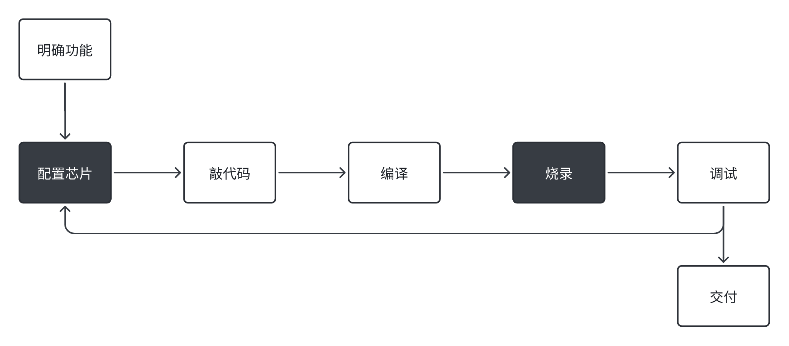
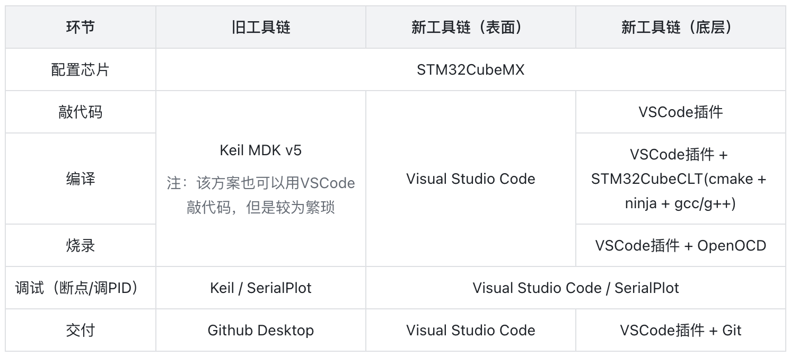
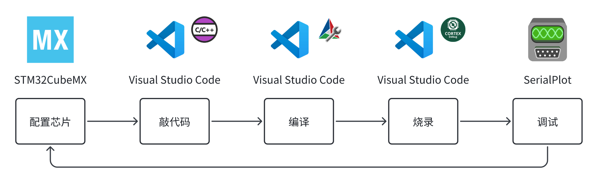

## 引言
各个软件傻傻分不清？各种软件操作记不住？本文希望通过介绍「工作流」和「工具链」，帮助大家更好地理解、记忆、使用本开发环境所涉及到的软件。

## 工作流
电控组的工作可以分为两大类：硬件（走线、焊线、接线）和软件，前者本文并不涉及。软件相关的工作可以拆解为如下图所示的多个环节， 其中黑底白字的环节是「嵌入式开发」独有的环节。

举一个具体的例子，比如说你负责「麦轮底盘移动」功能的开发，上述流程可以具体为：
1. 明确功能：遥控器的输入被C板接收，C板进行速度解算，发送控制命令到电机，电机旋转使底盘移动
2. 配置芯片：
    1. 芯片的基本配置：配置时钟树、指定烧录引脚、添加freeRTOS的task等等
    2. 遥控器通信需要配置串口（UART），包括波特率、中断、DMA等等
    3. 电机控制需要配置CAN，包括CAN的传输速率、中断等等
3. 敲代码：
    1. 如何解析遥控器的数据？
    2. 如何将底盘的速度解算成轮子电机的速度？
    3. 如何发送电机的数据？
4. 编译：把敲好的代码编译成二进制文件
5. 烧录：把编译好的二进制文件下载到C板中
6. 调试：是否需要断点调试？底盘能否按照预期移动？移动速度能否更快？
7. 交付：代码版本管理

## 工具链
各环节对应的软件如下表所示，可以看出新工具链比旧工具链涉及更多的软件，更复杂，但这是值得的。

新工具链的各个软件在「工作流」上所处的位置如下图所示：

可以看出，VSCode是我们工作流的核心工具。然而，VSCode的本职工作只是「代码编辑器」，为了让它完成编译、烧录等工作，我们需要对应的「插件」和「配置文件」，从而使它和底层软件（见上表）对接。

这就是为什么我们每次都需要把[这4个文件](files/)拖到「项目文件夹」中：
1. `.vscode/`：
    1. `launch.json`：配置了「断点调试」
    2. `settings.json`：可自行逐行Google
    3. `tasks.json`：配置了「编译」以及「烧录」
2. `.clang-format`：代码风格和命名规范
3. `.gitignore`：可自行Google该文件名
4. `openocd.cfg`：用于配置芯片型号和烧录器种类

VSCode执行「编译」「烧录」「调试」的快捷键见[使用说明](how_to_use.md)。

## Visual Studio Code
如果你从未使用过VSCode，下面的内容可能可以帮你更好地使用它： 
1. VSCode有两种模式：打开文件和打开文件夹。前一种模式下，VSCode只是一个「文本编辑器」（类比Word），它有很多功能/快捷键来提高输入效率，如「多光标输入」「文本替换」等等；而后一种模式，VSCode可以读取到该文件夹下面的所有文件，这使得「全局搜索」「代码补全」「插件加载」等高级功能成为可能。
2. VSCode有丰富的自定义选项：一般通过读取文件夹中的`.vscode`文件夹内的各种后缀为`.json`的文件来进行设置。
3. VSCode有许多第三方扩展/插件来增强其功能，我们使用了C++插件、CMake插件、Cortex-Debug插件以及它们所依赖的种种插件。
4. VSCode有一个重要的入口，称为「命令面板」（Command Palette），可以使用`ctrl+shift+p`快捷键来打开，里面可以输入各种命令，例如输入`format document`来格式化代码从而使代码更加整齐。[使用说明](how_to_use.md)中的第5步就利用了这个入口来执行CMake插件。