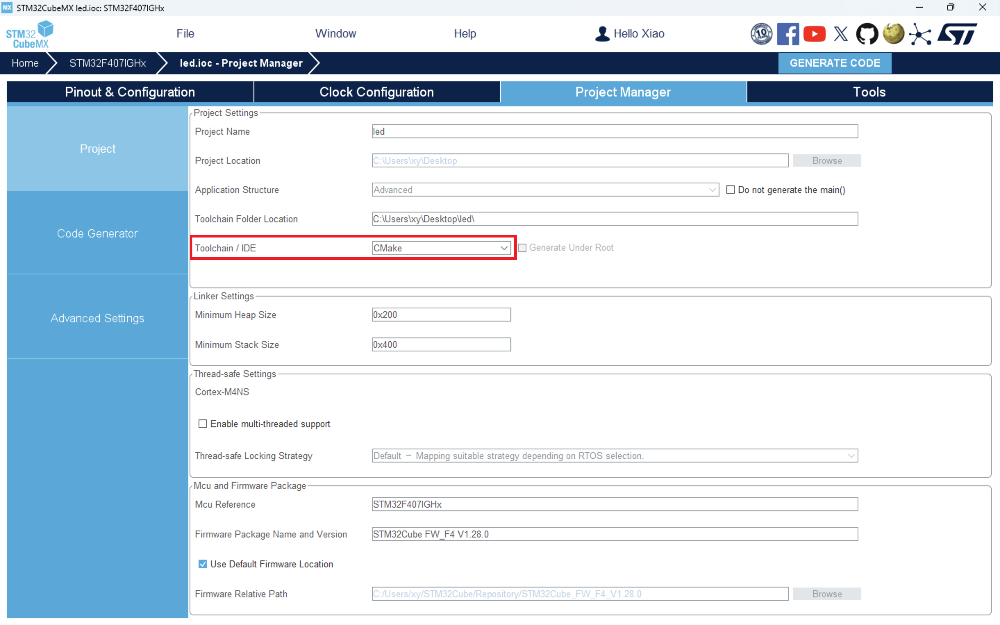
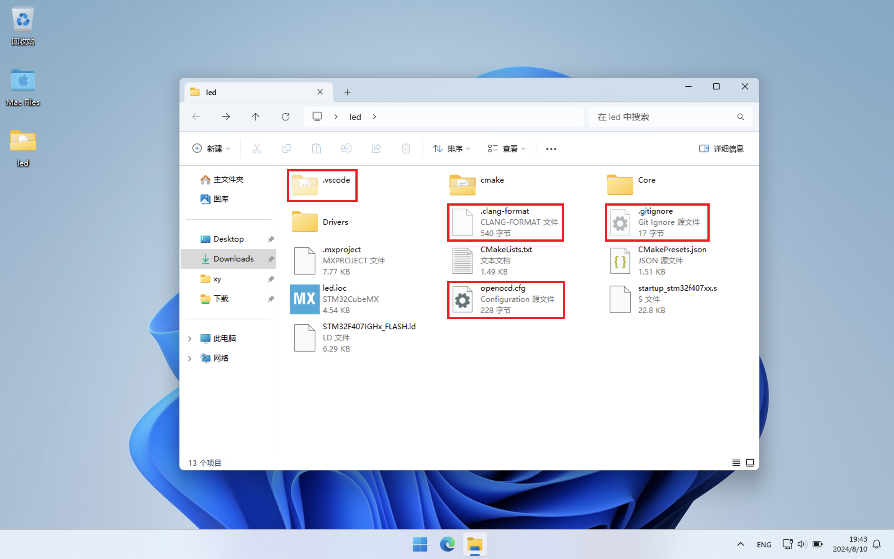
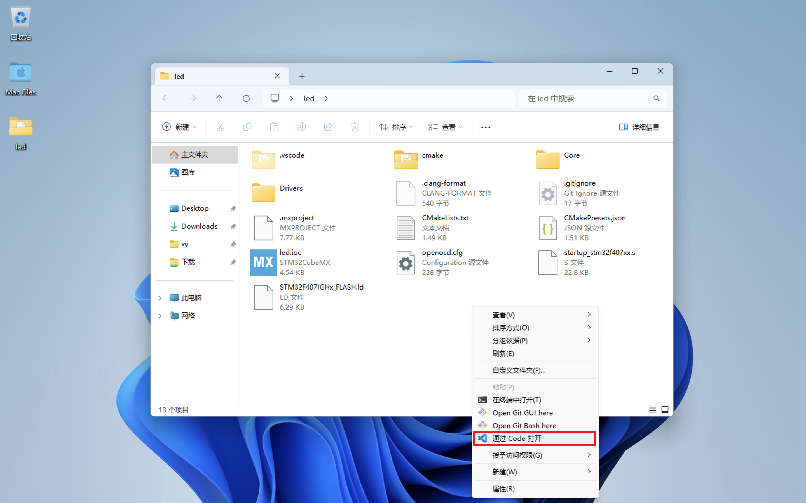
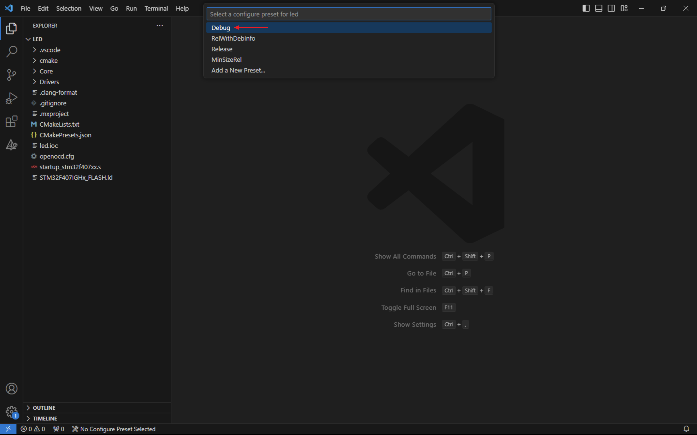
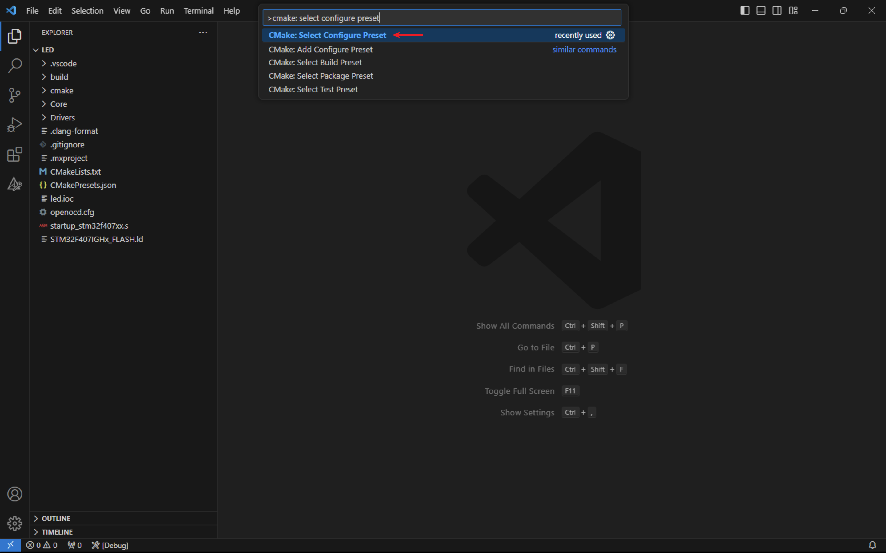
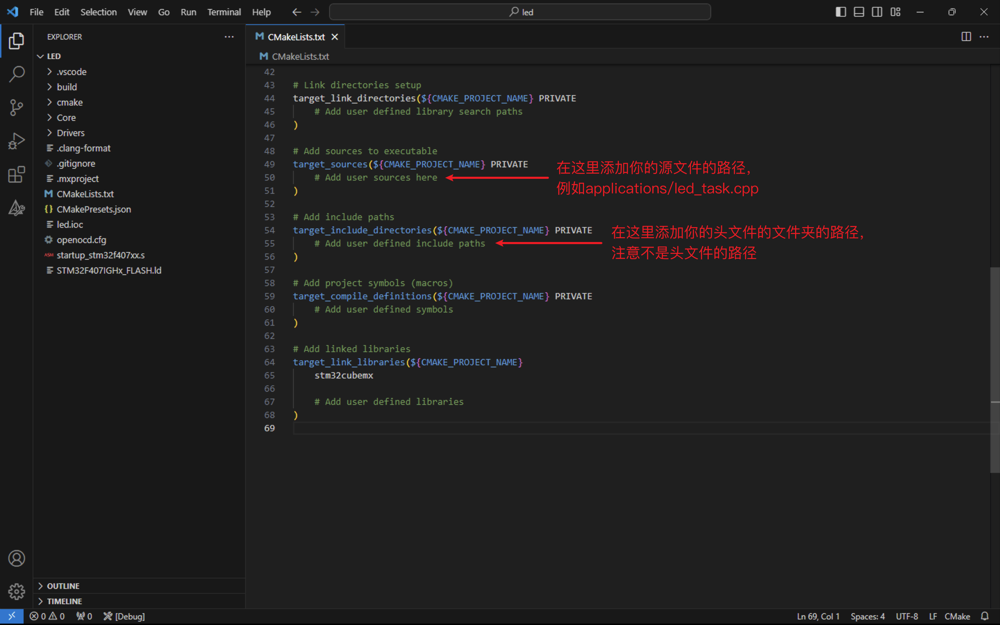
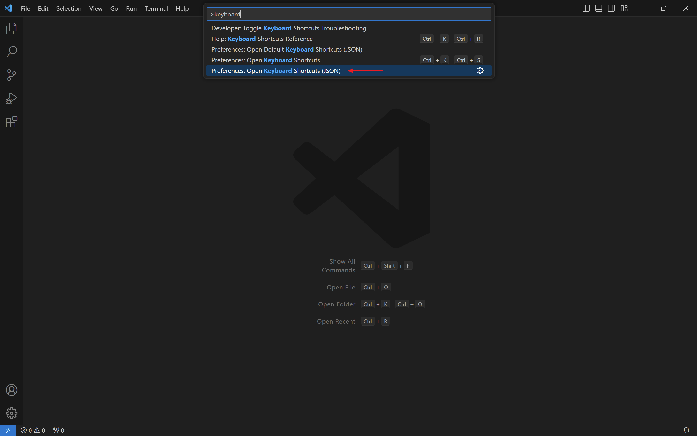

1. 使用STM32CubeMX生成项目时，选择CMake


2. 把[这4个文件](files/)拖到「项目文件夹」中


3. 使用Visual Studio Code打开「项目文件夹」


4. 第一次打开「项目文件夹」时，选择Debug


5. 如果错过了第4步，使用`ctrl+shift+p`快捷键，输入`cmake: select configure preset`，即可回到第4步


6. `f5`调试，`f7`编译，`ctrl+shift+b`烧录

7. 在`openocd.cfg`中可以配置芯片型号和烧录器种类

8. 自己创建的源文件和头文件需要在`CMakeLists.txt`中添加


9. (可选)将`f8`设置为「烧录」的快捷键
    1. 使用`ctrl+shift+p`快捷键，输入`keyboard`，选择下图中的选项：
    
    2. 把下面内容覆盖到该json文件中：
        ```json
        [
            {
                "key": "f8",
                "command": "workbench.action.tasks.runTask",
                "args": "OpenOCD: flash"
            }
        ]
        ```
    3. 保存后生效。
